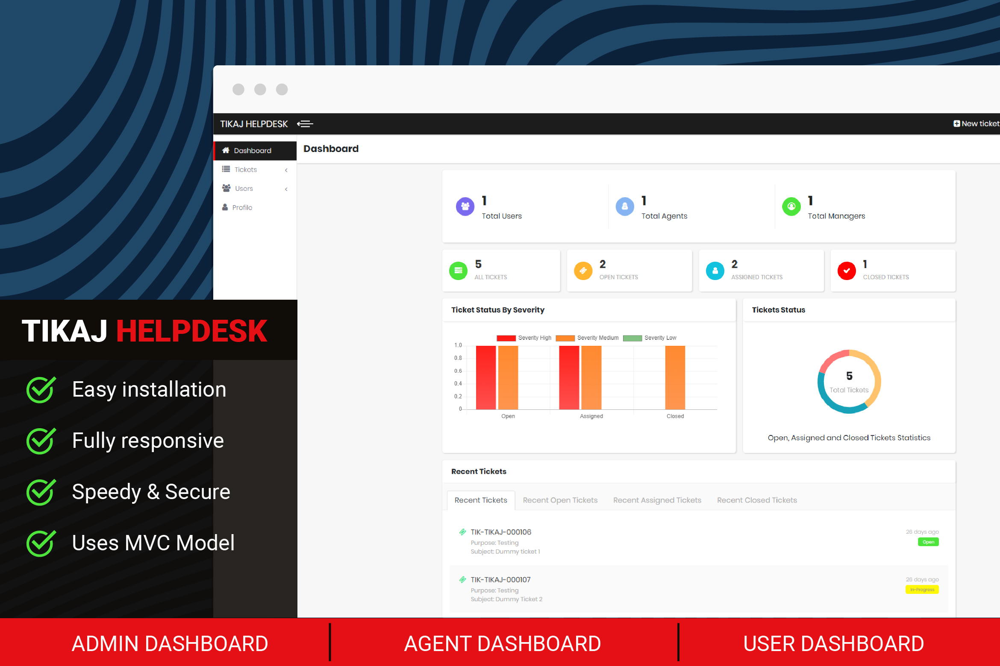
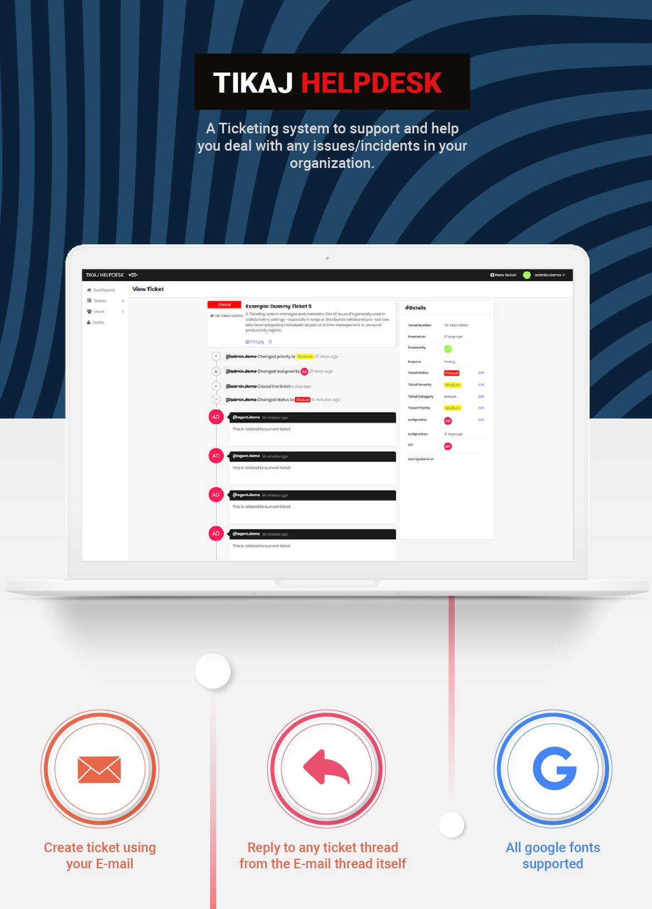

## Demo

<div align="center"><a href="https://tiket.app.tik.co/">Visit TIKAJ HELPDESK live demo</a></div>

### Credentials for logging in

|User type | Username | Password |
| ----------- | ----------- | ----------- |
| Admin | admin.demo | demo |
| Agent | agent.demo | demo |
| User | user.demo | demo |



## Features
- [x] Separate User Access Roles (Admin, Agent, User)
- [x] Automatically create Tickets by sending email
- [x] Reply to ticket thread by replying on associated email thread
- [x] Attachments in tickets as well as thread replies supported
- [x] Rich text editors supported
- [x] Ticket audit activity logged in thread - who performed what action and when
- [x] Informative dashboard reporting

## Prerequisites for this project
1. php v7.x.x
2. phpMyAdmin
3. Working knowledge of CodeIgniter framework

## Getting started
TIKAJ HELPDESK is completely build on our in house framework "Scone", Scone is based on CodeIgniter framework.

To start with the project follow these steps:
1. Clone this repository

2. Import `tiket_demo.sql` present in root directory

3. Run `composer install` in root directory

4. Run `cp application/config/client.sample.config.php application/config/client.config.php` _(Copy application/config/client.sample.config.php to application/config/client.config.php)_

5. Do the required changes in your `application/config/database.php`

6. Type this in your terminal `php -S localhost:8080` _(Can be modified from `application/config/client.config.php`)_

7. To Change email settings and stuff like that your can change the values in constants defined in `application/config/client.config.php`

8. To Change name of the product you can change the values in constants defined in `application/config/config.product.php`

9. Now you can login using these credentials

   
|User type | Username | Password |
| ----------- | ----------- | ----------- |
| Admin | admin.demo | demo |
| Agent | agent.demo | demo |
| User | user.demo | demo |
7. All done! You can enjoy now!

   

## Checkout all of our projects

Here at [Phoenix](https://lab.tik.co/explore/projects)


## Authors

- [Madhurendra Sachan](https://github.com/m301)
- [Deeksha Gupta](https://github.com/eksha)
- [Mansoor Ahmad](https://github.com/M33P0)


## License

```
Copyright 2019-2020 TIKAJ Technologies Private Limited.

Licensed under the Apache License, Version 2.0 (the "License");
you may not use this file except in compliance with the License.
You may obtain a copy of the License at

http://www.apache.org/licenses/LICENSE-2.0

Unless required by applicable law or agreed to in writing, software
distributed under the License is distributed on an "AS IS" BASIS,
WITHOUT WARRANTIES OR CONDITIONS OF ANY KIND, either express or implied.
See the License for the specific language governing permissions and
limitations under the License.
```

Developed with :heart: at [TIKAJ](https://www.tikaj.com) 
